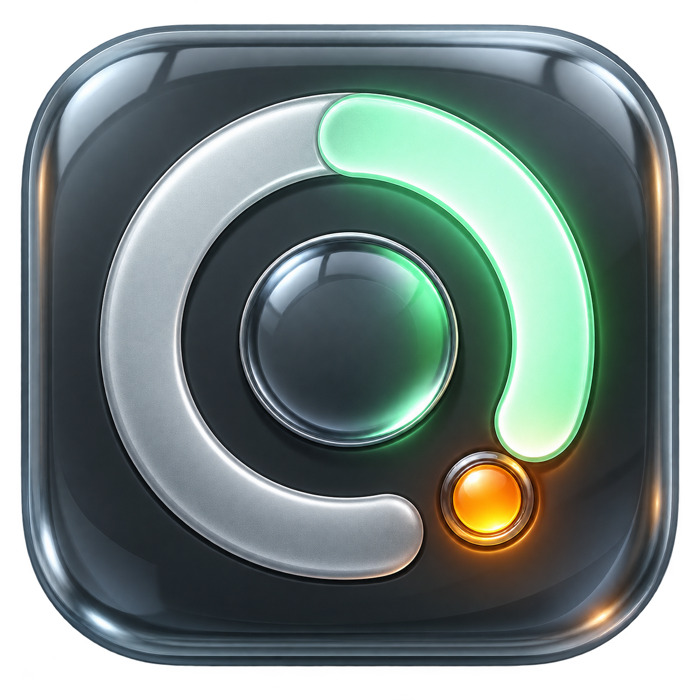

# Agent Usage

A Windows overlay showing what is left of your Codex and Claude limits, when
each window resets, and whether you will run dry before it does.



It reads a small collector over SSH or WSL. The Windows app never opens a
credential file.

## Reading it

Meters show what is **left** and drain as you work. Choose **5-hour** or
**Weekly** to select the large centered reading in every gauge, in either mode.
The choice is remembered. Both windows remain visible in the expanded meters;
the small notch marks the fraction of the window's clock remaining.

Provider symbols distinguish Codex and Claude without colored side borders.
Expanded details include banked resets, credit balances, and extra usage.
Hover over the banked-reset count to tween open its local expiration dates
inline. The section closes when you move away; it never floats over other data. Missing expiry metadata is labeled unavailable;
a server-reported non-expiring reset is labeled **No expiration**. Older
collectors still work, but need updating to supply the new expiry details.

Compact mode is a centered 192 × 64 strip for three accounts at 100% scale. Hover to
smoothly reveal the window selector and expand button. Hover an account to
expand a small row with its exact reset date/time. Reduced-motion preferences
are respected.
Double-click to fold down to the gauges. Drag to move. Use the pin to toggle
always-on-top. Expanded views scroll when the details exceed the monitor height.
The Windows renderer uses per-monitor DPI scaling and fully opaque text over a
glass-style surface, rather than fading the entire window. Confirm sharpness
on each monitor after rebuilding; browser rendering cannot validate Windows DPI.

A sample-only browser companion is in [preview/](preview/README.md). Accepted
design changes are implemented in both renderers; no live account data is served.

## Install

### Windows download

[Download AgentUsage-Windows.zip](https://github.com/f-petrozzi/Agent-Usage/releases/latest/download/AgentUsage-Windows.zip),
extract it, then double-click **Install.cmd**. On first install, enter your
collector's SSH target or press Enter for WSL. Updates preserve that choice.
The ZIP contains source and compiles locally using Windows' built-in .NET
Framework compiler. It includes the app icon; no SDK is needed.

For future releases, open **Update Agent Usage** from Start. It downloads the
latest release, verifies its SHA-256 checksum, rebuilds, and relaunches. Windows
may ask you to allow the downloaded unsigned installer. The update does not
install the Linux collector: update that separately as below.

### Collector


On the machine that runs your agents. Needs Python 3.9+ and `codex` and/or
`claude` signed in:

```bash
git clone https://github.com/f-petrozzi/Agent-Usage.git
cd Agent-Usage && scripts/install-agent-usage.sh --force
agent-usage --timeout 25          # check it
```

Then copy `windows/` to the PC and run it from PowerShell:

```powershell
.\windows\install.ps1 -Ssh user@host    # omit -Ssh to read the local WSL
```

`-Autostart` launches it at sign-in, `-Force` updates an existing install,
`.\windows\uninstall.ps1` removes it.

Codex is read from `~/.codex`, or from every profile under
`~/.local/share/codex-accounts/profiles/` if you keep several. Claude uses
whatever `claude` is signed in to.

```bash
agent-usage --codex-accounts a b   # only these profiles
agent-usage --no-claude            # skip Claude
agent-usage --self-test            # check the parsers
```

## Notes

**Point it at the machine that runs your agents.** Usage is server-side and
reads the same from anywhere, but only that machine knows when a prompt just
ran, which is what sets the poll rate.

**Polling is change-driven,** not a fixed timer: 60s while a CLI is active,
backing off to 600s when nothing moves, and jumping to a reset the moment it
lands. Neither read costs model tokens.

**Codex** comes from the app-server `account/rateLimits/read` method.
**Claude** comes from `GET /api/oauth/usage`, the endpoint `/usage` itself
calls, falling back to parsing `claude -p /usage` when the cached token is
stale. That endpoint is not a published API, so the fallback is the guarantee.
No login, logout, or account change is ever performed.

## Tests

```bash
tests/test-agent-usage.sh    # the collector
.\windows\install.ps1        # compiles, then runs the app's --self-test
```

## License

[MIT](LICENSE)

## Claude request throttling

Claude usage is cached for five minutes per credential on the collector host.
A 429 respects `Retry-After` (seconds or HTTP date), with a five-minute minimum
and increasing fallback cooldown up to one hour. No CLI fallback runs on 429.
The last successful values stay visible with a rate-limit warning. When no
previous reading exists, the frame shows the retry time instead. A file lock
shares the cooldown between frames using this collector on the same host;
other machines and applications have their own polling behavior.

The cache under `~/.cache/agent-usage` contains usage metadata, not credentials.
The collector must be updated for this fix to take effect:

```bash
git pull --ff-only
scripts/install-agent-usage.sh --force
```

## Publishing an update

The Windows build workflow checks compilation, the embedded icon, PowerShell
syntax, and the native parser/selection self-test on pushes to main.
Run `python3 scripts/package-release.py /tmp/agent-usage-release`, then publish
`AgentUsage-Windows.zip` and `SHA256SUMS.txt` as assets of the new tagged GitHub
release. Existing Update shortcuts will discover that release.
