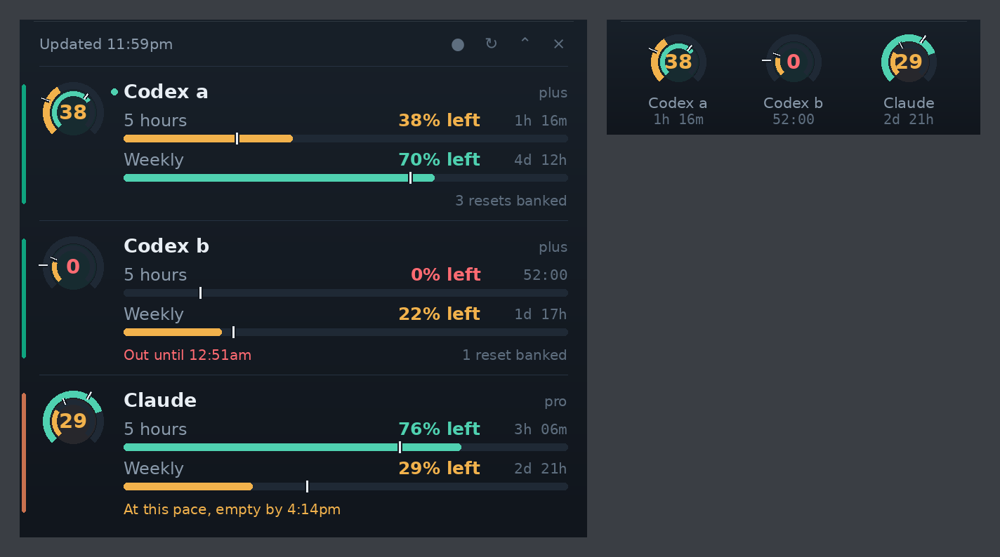

# Agent Usage

A Windows overlay showing what is left of your Codex and Claude limits, when
each window resets, and whether you will run dry before it does.



It reads a small collector over SSH or WSL. The Windows app never opens a
credential file.

## Reading it

Meters show what is **left** and drain as you work. The notch marks how much of
that window's clock is left: fill past it means you are ahead, fill short of it
means you run out before the reset. Outer ring is the 5-hour window, inner is
weekly, and the centre number is whichever is tighter.

Double-click to fold down to the gauges. Drag to move.

## Install

On the machine that runs your agents. Needs Python 3.9+ and `codex` and/or
`claude` signed in:

```bash
git clone https://github.com/f-petrozzi/Agent-Usage.git
cd Agent-Usage && scripts/install-agent-usage.sh
agent-usage --timeout 25          # check it
```

Then copy `windows/` to the PC and run it from PowerShell:

```powershell
.\windows\install.ps1 -Ssh user@host    # omit -Ssh to read the local WSL
```

`-Autostart` launches it at sign-in, `-Force` updates an existing install,
`.\windows\uninstall.ps1` removes it.

Codex is read from `~/.codex`, or from every profile under
`~/.local/share/codex-accounts/profiles/` if you keep several. Claude uses
whatever `claude` is signed in to.

```bash
agent-usage --codex-accounts a b   # only these profiles
agent-usage --no-claude            # skip Claude
agent-usage --self-test            # check the parsers
```

## Notes

**Point it at the machine that runs your agents.** Usage is server-side and
reads the same from anywhere, but only that machine knows when a prompt just
ran, which is what sets the poll rate.

**Polling is change-driven,** not a fixed timer: 60s while a CLI is active,
backing off to 600s when nothing moves, and jumping to a reset the moment it
lands. Neither read costs model tokens.

**Codex** comes from the app-server `account/rateLimits/read` method.
**Claude** comes from `GET /api/oauth/usage`, the endpoint `/usage` itself
calls, falling back to parsing `claude -p /usage` when the cached token is
stale. That endpoint is not a published API, so the fallback is the guarantee.
No login, logout, or account change is ever performed.

## Tests

```bash
tests/test-agent-usage.sh    # the collector
.\windows\install.ps1        # compiles, then runs the app's --self-test
```

## License

[MIT](LICENSE)
