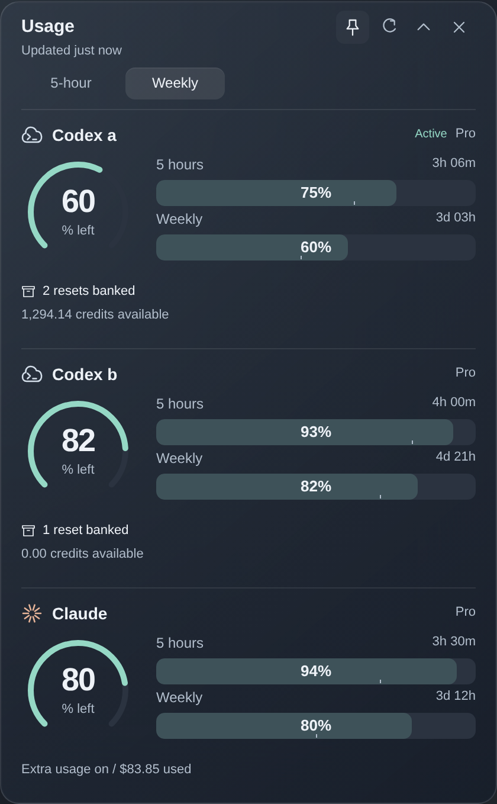
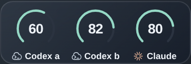

# Agent Usage

A small Windows overlay for Codex and Claude usage, reset times, and banked resets.
Switch between 5-hour and weekly readings. Hover to reveal details.
The gauge animates between periods and respects reduced-motion settings.
Small ticks in the horizontal bars mark the percentage of time left until reset;
a fill ending before the tick means allowance is being used faster than an even pace.

<p><br></p>
<sub>Expanded and compact design previews.</sub>

## Install

Install the collector on the machine running your agents:

```bash
git clone https://github.com/f-petrozzi/Agent-Usage.git
cd Agent-Usage
scripts/install-agent-usage.sh --force
```

[Download the Windows ZIP](https://github.com/f-petrozzi/Agent-Usage/releases/latest/download/AgentUsage-Windows.zip),
extract it, and run **Install.cmd**. Enter the collector's SSH host, or press
Enter for local WSL.

Needs Windows 10/11 and signed-in Codex/Claude CLIs on the collector machine.
The unsigned app builds locally with Windows' built-in compiler.

## Update

Open **Update Agent Usage** from Start. On the collector machine, run
`git pull --ff-only && scripts/install-agent-usage.sh --force`.

Claude reads are cached, and HTTP 429 responses trigger a shared cooldown.
The app never opens credentials on Windows. [MIT license](LICENSE).
