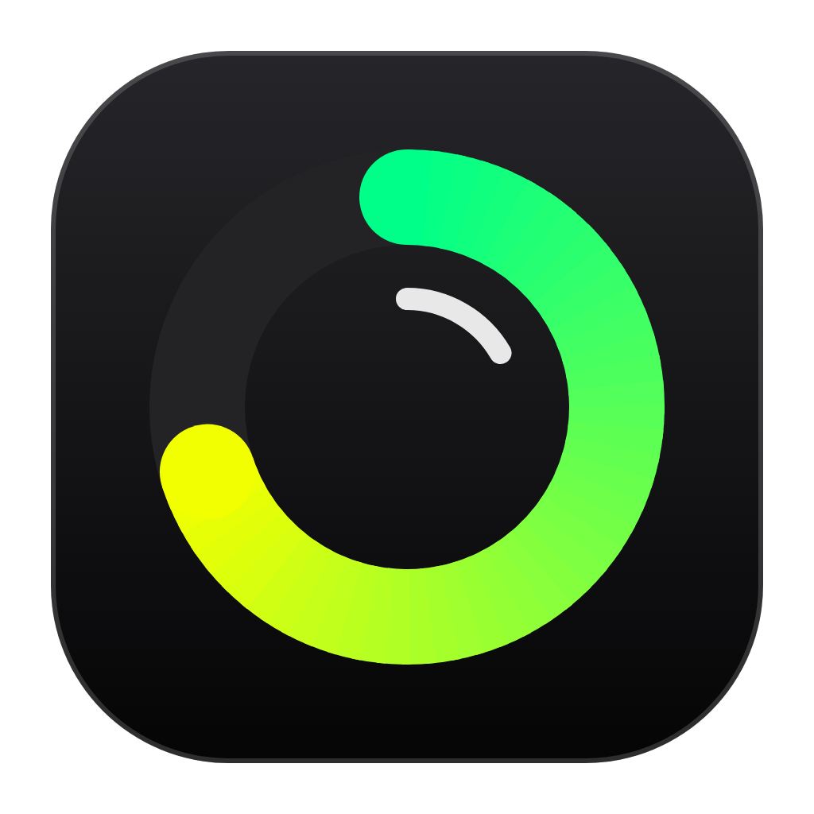
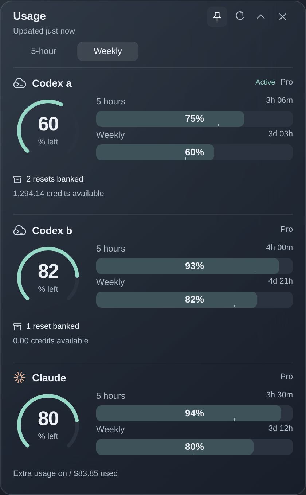
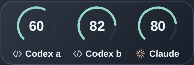

# Agent Usage

<p></p>

A hidden-at-startup Windows edge notch for Codex, Claude, and Antigravity usage, reset times,
and banked resets. Hold **Scroll Lock** to reveal it and follow your cursor
around either monitor's edges. Release, then rest the pointer on an agent to peek at its
usage; click it to hold the card open until you click elsewhere (refresh is the card's
own button).
Colored rings show usage consumed; right-click to switch between 5-hour and weekly
readings or change the shortcut.

[Notch controls, G815 setup, and validation](docs/notch.md). Opening Agent Usage
again from Start reveals the existing instance.

<p><br></p>
<sub>Previous panel previews; the default interface is now the edge notch.</sub>

## Install

Install the collector on the machine running your agents:

```bash
git clone https://github.com/f-petrozzi/Agent-Usage.git
cd Agent-Usage
scripts/install-agent-usage.sh --force
```

Download **AgentUsage-Setup-&lt;version&gt;.exe** from the
[latest release](https://github.com/f-petrozzi/Agent-Usage/releases/latest) and run it.
It installs per-user without administrator access and migrates a ZIP install in
place. Choose local WSL or an SSH host in Settings → General.

Needs Windows 10/11 and signed-in provider CLIs on the collector machine.
The installer is unsigned, so SmartScreen may ask you to confirm it.

## Update

A steady blue dot at the notification corner announces an update. Hover it to grow the download options; **Update ready** offers a separate click to restart once the download is verified. Update options take priority over agent notifications. Settings → General → **Update** → **Restart** remains available. On the collector machine, run
`git pull --ff-only && scripts/install-agent-usage.sh --force`.

Claude reads are cached, and HTTP 429 responses trigger a shared cooldown.
The app never opens credentials on Windows. [MIT license](LICENSE).

Codex stream reads frame raw pipe bytes so coalesced notifications and replies do
not cause false timeouts. Regression: `python3 tests/test-codex-stream.py`.

The working arc rotates smoothly on its own small compositor layer. It pauses
when the notch is hidden or that account is collapsed, preserves its phase across
collector updates, and stays still when Windows reduced motion is enabled.

## Alerts and account order (3.1)

Settings → General now offers usage warnings at 80% and 100%, optional alerts when
an agent waits for input or finishes working, and a notification sound. Usage warnings
and finished-working alerts are on by default (3.2.0); waiting and sound are off.

Finished alerts come from each tool's own record of a turn: Claude Code's per-session
status file (busy, waiting, idle), the task_started / task_complete events in a Codex
session rollout, and Antigravity's conversation status while its CLI holds the session.
A turn has to run at least 30 seconds (a quick reply was watched as it happened), a
canceled turn never counts, and the alert says how long it worked.

Alerts appear in the notch, not as Windows toasts. Since 3.2.1 each one grows out of its
account's ring as a sliver of the notch sized to its text (side-edge slivers give it more breathing room): a word in the
colour of what it reports (the usage level, yellow for an agent waiting on you) and the
reading or session, such as "Finished homelab · 14 min". Alerts for several accounts come
out of their own rings together on side edges; top/bottom lifts show accounts in order to keep text from overlapping. A sliver stays about six seconds, longer while the
pointer rests on it; pointing at it counts it as seen, and a click opens the linked Claude or Codex conversation in VS Code. Alerts without a session link open that account's usage, held. An open card comes first: alerts wait for it. The sound is a short chime
made by the app.

The notch keeps them too (3.1.8): the pin's pocket holds more than one control. Point
at the pin and scroll, and it flows back into the notch while a bell buds out of the
same flare; scroll again for the pin. A yellow dot in the notch's rounded front corner, at the
pin's end, means an alert you have not seen yet: one that came and went without being pointed at.
Point at the dot and the bell is drawn out of that corner with the dot on its shoulder, a second
way to the same log. Press either bell and the last week of alerts (up to 40)
grows out of that end of the notch, newest first, with the alert switches (Usage,
Waiting, Finished, Sound) along the top. A row opens its linked VS Code conversation, or that account's usage when no link is available; Clear empties the log. The log fits the notch's width on top/bottom edges where readable and stays centered beneath/above it. Side edges retain a compact, top-aligned log. Settings → Appearance → Controls chooses what the pocket holds.
The notch's expansions, alerts included, are liquid while they grow and sharp at rest.

Warnings track each reported quota window, retain their threshold across app
restarts, and rearm when a later reset boundary confirms a new window. The initial
reading establishes a baseline, so starting the app does not send old warnings.
Mute individual accounts with the bell under Settings → Accounts. Drag an account
(or focus it and press Alt+↑/↓) to reorder the notch and tray; the small notch at
the top of the page follows along. Visibility stays independent.

Enable the tray icon under Appearance for account usage, every reported window,
reset countdowns, and stale status, plus a Refresh action.

Completion requires an observed working → explicit idle/turn-ended transition.
Canceled turns, vanished processes, stream failures, initial readings, and
reconnections do not announce completion. “Finished working” means the turn ended,
not that its result was successful. Waiting → idle does not announce completion.
Codex question tool calls show Waiting until an answer arrives, even while async
questions allow background work to continue. Enable **Agent waiting for input**
under Settings → General to receive these notifications. Codex does not expose
command approval waits in its rollout. Update the collector alongside
the desktop app to enable the new terminal states; older collectors still provide
usage and active/waiting indicators.

## Antigravity

Sign into `agy` with your Google AI Pro account on the collector machine.
The collector automatically adds Antigravity when `agy` is on PATH or installed in `~/.local/bin`, using
`agy -p /usage --output-format json` (requires agy 1.1.11 or later).
It shows measured weekly and five-hour Gemini usage with reset times. Hover the
Antigravity usage title on top/bottom edges to reveal Claude/GPT quotas in the separate extras frame. Side edges show extras and account metadata inside the usage view by default and extend the frame when needed. It does not infer quota from model availability
or label CLI reports with account identity or a plan the CLI does not provide.
Use `--no-antigravity` to skip it. Update the collector alongside the Windows app.

While reading one account, the other gauges become small account glyphs. Hover
a glyph or focus it with the keyboard to switch; leaving restores all gauges.

AGY CLI activity uses its live presence lock and local conversation status database. Active work spins the inner arc; explicit pending questions and reported waiting steps pulse yellow, including when AGY reports the conversation as idle. Idle conversations without pending input, canceled, killed, and disconnected conversations clear the indicator. Approval waits that AGY does not expose in its transcript cannot be distinguished from active work.

Claude shows available free limit resets and the soonest expiry instead of the subscription name, as a row of the usage card on every edge (Codex banked resets use the same row). Point at the row and it opens to each reset against its own date and time and how long is left, soonest first, so you can see which to use by when. The collector requests the `cedar_ember` grant block with the newest Claude CLI on the host as its version, since the endpoint only returns resets to a current CLI: over non-interactive SSH, PATH alone found an old npm global in `/usr/bin` and the resets never arrived. It counts usable unpaused grants and never forwards redemption handles. Unsupported or ineligible responses leave the count unknown. Redeem resets in Claude itself.

## Alert refinements (3.2.4)

Claude completion timing retains the beginning of a continuous busy stretch, even when Claude Code rewrites its status timestamp during tool activity. The explicit idle timestamp ends the duration. The 30-second minimum and cancellation/disconnection rules remain.

Waiting/completion notifications and alert rows link to VS Code. Working/Waiting session text in account details is clickable too. Version 3.2.5 launches the installed Code executable directly and installs the bundled Agent Usage Link helper on the first terminal-linked click. The collector supplies process ancestry from `/proc` metadata, without reading process environments or terminal contents. In the focused matching workspace, the helper matches those ids against VS Code's existing terminals and focuses the right tab without sending text or starting a terminal. Remote SSH/WSL workspaces must expose the collector's Linux shell ids; a local Windows terminal launching WSL may expose only a Windows wrapper pid.

If the terminal has closed, Claude's session URI focuses/resumes its conversation and Codex opens its conversation view; no prompt is submitted. The renderer supplies only a logged alert id or account/session id, and the desktop resolves it against stored/current sessions. Older completion rows try a bounded metadata-only history query: provider/account/name and one recorded turn end within 15 seconds of the alert. Missing/ambiguous historical links, including old waiting rows that cannot be reconstructed, and launch failures display an explanation. Usage alerts and unsupported providers still open account usage. Windows focus, first-click helper installation and remote terminal PID correspondence need a device check.

Side-edge slivers are thicker; top/bottom notifications make a smooth, text-sized lift rooted at their gauge and clamped to the notch width, with status and detail on two lines. The Alerts panel follows the notch width on top/bottom edges (a measured minimum for all four switches on one row), centered on it; side edges use a panel at least 228px wide and keep its top alignment. Rows stack status and details below the account/time to fit the compact width. The unread dot sits in an existing bezel corner and shrinks away during a pocket swap, then appears on the revealed bell; the pin never carries a badge. All native hover tooltips are removed from the notch and Settings; accessible control labels remain.

Validation: 31 desktop regression checks, 13 collector session checks, notification and bell browser checks including session clicks, all four edges, reduced motion, sound and alert holding. Browser screenshots use synthetic snapshots. Update the installed collector as well as the Windows app to carry session links.

## Session links and alert controls (3.2.5)

Notification corners share the notch's 20px radius. Top/bottom lifts reserve curved shoulders inside the notch's rounded ends, including for corner accounts, with two centered text lines.

Side notifications stop growing at the default 228px notch length. Overflowing detail text scrolls slowly after a pause while its status remains still, including on top/bottom edges. The alert stays long enough for one pass. Reduced motion keeps the text stationary.

The four alert switches never wrap. Account details retain session ids and render Working/Waiting rows as keyboard-accessible buttons. `vscode-link/` is a small UI extension using `Terminal.processId` and `Terminal.show(false)`; `scripts/package-vscode-link.py` produces the dependency-free VSIX bundled with the installer. `desktop/session-open.cjs` installs it through Code's CLI, then launches a fixed URI built from validated session/process identities. Standard user/system Code install locations are checked before a registered-protocol fallback. Keep the matching workspace open in the focused window; the helper does not switch workspaces automatically.

Validation: 36 desktop regression checks, 15 collector checks, notification and bell browser checks on every edge including single-row controls, old-link errors and Working clicks. Helper/launcher tests cover terminal selection, installation, direct Code launch, fallback and invalid targets. Update the collector alongside the Windows app. Actual Windows focus and first-click installation need a device check.

## Notification testing and history (3.2.6)

Settings → Accounts has a Test notification button for each account. One sample stays visible until turned off, replaced by another account's test, or Settings closes. Hidden accounts receive a temporary gauge without changing their saved visibility. Samples use the normal notification shape and scrolling, without sound, history entries or session links.

The bell history scrolls within a 228px list while the heading and switches remain visible. All 40 retained alerts are reachable; refreshes preserve the list's scroll position. Helper installation follows the installed Code CLI wrapper, clears its development flag and allows 60 seconds. Failures include the underlying installer reason. The Windows workflow installs the packaged VSIX through real Code from Electron using isolated settings/extensions before publishing. SSH terminal focus still requires the matching remote workspace to be open.

Validation: 37 desktop checks; browser checks cover history wheel scrolling on every edge, preserved scroll position, per-account testing, hidden-account restoration and reduced motion.

## Account-shaped notifications and monitor changes (3.2.8)

Side-edge notifications span the gauge and its percentage together (at least 76px before text insets). Top/bottom notifications grow from the account's physical section: the outside flank for each end account, and a centered neck for middle accounts. Smooth shoulders feed into a compact 128–160px text body with the notch's 20px corners. Bottom-edge account order is mirrored correctly; long details still pan without extra rows.

The bell history and overflowing account panels use a 6px dark scrollbar with a transparent track, rounded thumb and brighter hover state. The notch keeps that style even when Settings uses the light theme.

Monitor changes mask the native window before moving it. The renderer snaps to the destination edge, waits for the new viewport size and two animation frames, then acknowledges the placement before the window is revealed. Superseded acknowledgments cannot expose an earlier destination. Ordinary perimeter travel stays animated.

Validation: 40 desktop checks; browser checks cover full-account side bands, all four physical top/bottom account positions, themed history scrolling on every edge, asynchronous monitor resizing, successive switches and same-sized monitors. Actual Windows monitor/DPI transitions still need a device trial.

## Even notification sections and hidden spawns (3.2.9)

Side-edge notifications divide the entire visible notch height equally among its displayed accounts, including end padding. Each fills that account's physical section; the outside top/bottom notification edges match the notch ends.

All notification bodies are simple rounded rectangles using the notch's 20px corner radius. On top/bottom edges, end accounts align with the same outside notch edge. Middle accounts sit closer to the notch center with a slight offset toward their account's side. Spring growth and the temporary goo filter remain, and long details still scroll.

Revealing a hidden notch now masks the native window before moving it and chooses the destination cursor edge before sending a layout. This closes the separate hidden-spawn path that could briefly expose the previous edge. If the pointer crosses another edge during resize, that edge is prepared before the window becomes visible.

Validation: 42 desktop checks; notification browser checks cover equal side partitions for one through four accounts on both sides, rectangular top/bottom placement and text scrolling. Motion checks cover a hidden right-edge notch spawning on the next monitor's left edge. The Windows build verifies these desktop checks and packaged helper installation; actual monitor composition still needs a device trial.

## Settled monitor transfers (3.2.10)

A monitor transfer clears the rendered notch before moving the native window, including fully opened arms, hovered discs and pocket animations. Main waits for a transparent renderer frame, moves to the latest cursor monitor/edge, and keeps native opacity at zero until the destination notch has opened and painted. The 170ms visible-transfer delay is removed. Late events from the old position cannot reopen the surface during placement.

Validation: 44 desktop checks cover clearing/move/reveal ordering, stale acknowledgments, pointer changes during clearing, returns during painting and hidden spawns. The browser motion suite waits for fully settled arms, transfers repeatedly across all four edges, compares the cleared surface against a blank screenshot, and checks every new frame for the correct edge and along-edge position. Actual Windows monitor composition remains a device trial.

## A liquid alert log (3.3.0)

The bell's log is drawn in the notch's own ink. Usage, Waiting and Finished are drops of white in dark wells: switches that are on side by side run together through a neck, so what is on reads as one body. Turning one off draws its drop in to its middle; the neck to each neighbour stretches into a thread, parts, and its ends sink back into their drops. Turning one on wells a round drop up from the middle that spreads along the switch and reaches out to an on neighbour. The words invert exactly where the ink is under them. Sound is its own drop in the title row.

Each row reads like the notification it came from: the status word in its colour with the time, then the account and the session or reading. One bead of ink sits under the row the pointer (or keyboard focus) is on and runs between rows like a drop, stretching on the way and gathering on arrival. The list pours out of the title row as the log opens, an alert arriving while it is open swells into place as the rows below make way, and Clear draws every row up into the title row before the log empties and the lobe draws back. The history fades into the black at whichever end has more to scroll.

Scrolling the pin/bell pocket and then moving away no longer leaves a blank black disc that pops into the arm: the swap finishes with its new glyph, swings, and only then melts back into the arm the way a hover ends. The unread dot no longer flashes onto a bell that is on its way home.

Validation: 44 desktop checks; every browser suite, including new checks for joined and parted switches, the sound drop, the row bead, the Clear drain and a swap left mid-way (drop out for the whole swap with its glyph showing, then no frame-to-frame jump as it melts home). Reduced motion makes every change immediate.

## The bell grows out of the unread dot (3.3.1)

The unread dot has moved off the bezel to the notch's rounded front corner at the pin's end, centred in that rounding, so it needs no extra room. Pointing at it is a second way to the alert log beside scrolling the pin: the corner swells, and a drop of the notch's ink is drawn out along the corner on a strand that thins and parts, the same goo as the pin pocket. The bell sharpens on the drop and swings from the snap while the yellow dot stretches as it rides out and settles on the bell's shoulder. Moving away, the corner reaches out, swallows the drop, and the dot slides home. Pressing the bell opens the log, which grows over that corner and takes the bell in with it. Near a screen corner the bell turns toward the notch's front so it stays on screen.

Validation: every browser suite, plus `tests/browser/notch-sprout.cjs` for the rest position on all four edges, the goo, strand, snap and swing, the dot's ride onto the bell, hit and control rectangles while the bell is out, press to log without pressing the ring underneath, the swallow on leave, quick passes, keyboard focus, a notch carried near a screen corner and reduced motion (immediate, never liquid).

## Links work from the first click (3.3.2)

Every launch used to reinstall the VS Code helper on the first session link you pressed, and the VS Code window already open then ignored that link until a new window was opened. That first press was usually an alert, so alerts seemed not to route while log rows and Working text did. The helper is now installed only when VS Code does not already have this version. When a link has to start VS Code, the helper waits up to 15 seconds for the workspace's terminals to come back before falling back to the conversation. While an alert is out, the bell in the corner stands aside so a press near it reaches the alert.

The helper itself is updated to 0.1.1 once, on the first terminal link after this update. A VS Code window that was already open may need **Developer: Reload Window** (or a new window) that one time before its links route.

Validation: 46 desktop checks, including install-once, older-version updates and the startup wait, and every browser suite, including an alert beside the unread dot's corner.

## Buttons on first open, and a softer pinch (3.3.3)

On a first open, every press could miss the notch until it was moved to another screen and back. The notch drew and responded to hover, but the window that takes clicks had landed slightly off the screen it covers. The likely cause is screens at different Windows scaling. Clicks are now measured from where the window really is. If a placement lands off its screen, it is placed again, before you see it, from the screen it is now on, which is what moving it away and back did by hand. Each placement writes one line of geometry to `notch-diagnostics.log` next to `settings.json`, so it can be confirmed if it recurs.

The alert switches pinch like liquid when one turns off. The neck to each neighbour stretches as an hourglass, thins smoothly and gives while it still has body. Each half then springs back as a rounded drop, all inside the goo, so it never runs to a thin thread.

Validation: 49 desktop checks, including re-placement and offset-window hit tests, and every browser suite, including new checks that a switch's necks stretch, part once and never thin to a thread.

## Presses that always land, smoother goo and readable small mode (3.3.4)

If Windows doesn't deliver a press to the notch, as happened on some first opens, the app now delivers it itself. The helper that already caught presses on the pin and gear now watches the whole notch. When the page doesn't report a press within about a seventh of a second, the app presses that spot in the page and lets go when you do. Presses that arrive normally are left alone.

The switches' goo now has smooth, anti-aliased edges while it moves, instead of stepping like pixels. The same applies to every liquid shape in the notch.

Small mode keeps the notch small but draws card, log and alert text at about medium size, with the card widened to fit.

Validation: 50 desktop checks, including relayed and delivered presses, and every browser suite plus a new small-mode suite.

## AGY input requests (3.3.5)

Pending AGY questions and permission requests now take priority over its idle status, so asking for input shows Waiting instead of triggering a finished-working notification. An explicit conversation WAITING status also shows Waiting when the transcript is unavailable. Waiting notifications still follow the existing alert setting.

Update the collector alongside the Windows app. Validation covers idle questions, permission requests, partial transcript writes, answers clearing old requests, and completion alerts after work resumes.

## Codex question notifications (3.3.6)

Codex now shows Waiting and sends the enabled waiting notification when it calls `request_user_input` or `request_user_input_async`. Async acknowledgments and ongoing tool work keep the question pending; the user's reply or the matching answer clears it. A completed, interrupted, or newly started turn clears old questions too. Question and answer text stays out of the session feed.

Enable **Agent waiting for input** in Settings → General. Update the collector alongside the Windows app. Validation covers synchronous and asynchronous questions, multiple outstanding calls, rejected prompts, partial writes, collector restarts, large tool outputs, and the session-feed notification path.

## Recent chats and one-click resume (3.3.7)

**Chat history** sits directly below the resets row on each account's usage card. Hover or focus it to unfold the 30 most recently updated saved sessions for that account, newest first. About three rows fit at once; the rest scroll inside the dropdown. Named sessions show their saved title, otherwise the workspace name and session ID identify them. Dates and live status help distinguish recent work. Refreshing usage retains the list's scroll position and keyboard focus.

Click a session to launch VS Code, even when it is closed. The bundled helper focuses its existing terminal on the matching host, or opens the session's SSH/WSL workspace in another window and resumes it in a terminal. Codex uses that account's `CODEX_HOME`; Claude uses its `CLAUDE_CONFIG_DIR`; Antigravity uses `agy --conversation`. No prompt is sent and the shared active account is not switched. This requires VS Code's Remote SSH or WSL support and an already signed-in CLI on the collector host. Standard VS Code connection and workspace trust prompts still apply. The 0.2.0 helper installs once; a VS Code window that was already running may need **Developer: Reload Window** once after its upgrade.

Update the collector with `scripts/install-agent-usage.sh --force`. `agent-usage --session-history --compact` reads bounded saved metadata without exporting message bodies or credentials. Desktop history queries are cached for one minute and reset when the collector host changes. Missing workspace metadata remains visible with an explanation instead of launching a different chat.

Validation: collector history checks for closed sessions, account homes, saved names, subagents, limits and Antigravity workspaces; desktop checks for safe resume arguments, remote window handoff, existing terminal focus and trust; browser checks for all four edges, scrolling, account switching, keyboard activation, small viewports and reduced motion. Actual Windows window activation and remote reconnection need a device check.

## Reliable session links and notch updates (3.3.8)

History links now preserve SSH/WSL addresses and session identity through VS Code's URI decoding and protocol routing. The 0.2.1 helper loads in a fresh window on its first upgrade, then reuses normal routing. The app waits for confirmation that the helper has focused or created the session terminal; connection, trust and missing-helper failures show an explanation instead of reporting success when Code merely starts.

Updates use the existing notification's fluid spring and shape, with yellow status text, a download action and a small progress line. A verified download offers Restart; it never restarts automatically. Agent notifications take priority, and updates wait while an account card or alert is open. Prompts return when the notch is next shown until acted on. A failed update offers Check again. The old Settings dot is removed.

Validation: 64 desktop checks including real VS Code URI parsing and loopback acknowledgements; browser checks for download/restart actions, progress, notification priority, all four edges, keyboard access and reduced motion. Actual Windows activation and SSH/WSL reconnection still need a device trial.

## Resume in the active VS Code window (3.3.9)

History clicks now prefer the active VS Code window and open a terminal tab there, even when its editor folder differs from the session's saved workspace. A window connected to the same remote authority starts the resume command directly on that host. If it uses another SSH alias/host, a local workspace or a different WSL distribution, the Windows UI helper creates a local SSH/WSL terminal in that window and connects to the saved target. Its working directory and CLI account still come from the saved session; editor folders stay open. Repeated clicks focus the tab, and an exited tab can be resumed again.

The app no longer forces an empty VS Code window during helper upgrades. It prepares the bundled 0.2.2 helper on app startup, before the notch appears. After updating/restarting Agent Usage, run **Developer: Reload Window** once in an already-running VS Code window to load that helper, then click a history session. If Code is closed, launching it still opens a window for the session. Workspace trust and normal SSH/WSL authentication still apply.

Validation: 68 desktop checks covering different folders, SSH aliases, local/empty windows, WSL selection, correct accounts, safe shell quoting, repeated/exited tabs, trust, helper preparation and acknowledgement errors; browser history checks on all four edges. Windows packaging also checks the real bundled VSIX installation. Actual window focus and SSH/WSL connections require the Windows device trial.

## Named terminals and pushed update notices (3.3.10)

Resumed terminals now show the agent and session title, such as **Codex · Agent Usage**, **Claude · Settings cleanup**, or **AGY · Dashboard**. If no title is saved, the workspace name identifies the tab; the short session ID is the final fallback. Terminal labels are bounded display metadata and never alter the resume command. Update and restart Agent Usage, then run **Developer: Reload Window** once in an already-open Code window to load helper 0.2.3. Existing terminals retain their current names; newly resumed sessions get the new labels.

Release publication now sends a signed release notice through free ntfy.sh. The installed Windows app keeps a listening connection open and verifies the notice before checking its normal GitHub update feed. It checks once at startup and catches up after reconnection, replacing the recurring six-hour checks. The relay carries release notices only.

A soft blue pulse in the notch's trailing corner signals an available update or a downloaded update ready to restart. Hover or focus the dot to grow the existing fluid notification: click **Download**, follow its progress, then click **Restart** once it is ready. Leaving lets the notification melt back into the dot; session alerts keep priority. Reduced motion disables the pulse and spring. Settings → General retains the manual Update and Restart controls.

Validation: desktop checks cover notice signatures, tampering, replay, chunked streams, reconnects, updater lifecycle, native dot clicks, session labels and safe resume commands. Browser checks cover the update dot and actions on all four edges, keyboard access, reduced motion, history and the alert bell. Live ntfy delivery and cached-message verification were checked before publication.

## Notification perimeter shimmer (4.0.0)

Notifications now send one glowy shimmer around the outside of the notch and the notification as it grows. A bright tip leaves a soft tail, travels one complete circuit over 3.2 seconds, then fades. The border follows the custom rounded shape and flares, with no line across the join between a notification and the notch. Finished notifications use white, waiting and usage warnings use their existing severity colour, and releases use blue. Bursts share the current circuit; download progress does not repeatedly restart it.

The effect is decorative and never intercepts clicks. Hiding, carrying, or transferring the notch clears it. A release received while hidden waits for the notch's next appearance. With reduced motion enabled, a quiet stationary outline appears briefly instead. Validation includes real rendered-pixel comparisons on all four edges, travelling/fading behaviour, merged outlines, notification click targets, bursts, hidden release notices and reduced motion, plus the existing alert, update and motion checks.

## Shared notification position and update priority (4.0.2)

Updates now use the notification corner and open their fluid options from that same end of the notch. The blue dot stays steady and replaces the yellow unread dot while an update is available. Update options take priority: opening them puts an interrupted unread agent alert back in the queue, and new agent alerts wait until the options close. Agent alerts remain in the notification log.

The border shimmer continues around the whole notch when update options retract, then finishes its original circuit. Validation covers shared placement and update priority on all four edges, queued and interrupted alerts, keyboard actions, reduced motion, and rendered-pixel checks for continued shimmer movement and completion after hover-off. All 76 desktop checks pass.

## Session switcher, pinned chats and focus mode (4.1.0)

Press **Ctrl + Scroll Lock** from any app to reveal the notch and open **Sessions**. Search across all accounts by chat title, workspace or session ID, or filter to one agent. Use ↑/↓ to choose a chat and Enter to resume it in VS Code; click a row for the same action. Escape or the shortcut closes the switcher. **Sessions…** in the notch's right-click menu is another way to open it. The list scrolls inside one bounded lobe on any screen edge.

Star a chat in the switcher or account's Chat history to pin it above recent sessions. Up to six pins per account survive app restarts and remain available after falling out of the recent list. Pins retain their original workspace and CLI account and are kept separately for each SSH host or WSL distribution. Resuming produces a small liquid ripple, followed by a check only after the VS Code helper confirms it opened the terminal. Failed launches keep an explanation in the switcher.

Several finished notifications gather into one **N finished** stack. Hover it to unfold the individual chats; click one to return to that session, including saved AGY conversations when the collector can identify them. Waiting and usage warnings keep their severity, and update options retain priority.

Choose the focus control in an agent's usage header, **Focus on…** in its right-click menu, or **Focus agent** under Settings → General. At rest, the notch contracts to that agent; hovering smoothly restores all agents. Choose the same control again, or **All agents** in Settings, to leave focus mode. Live gauge nodes remain intact through the transition.

The switcher, selection, focus contraction and resume accents use the existing notch's black surface and fluid motion. Focus springs stop once settled, accents have bounded lifetimes, and reduced motion removes the ripple and makes layout changes immediate. Validation includes 85 desktop checks and browser checks for all four edges, keyboard focus, hidden reveal, collector changes during loading, pin persistence/order, stacked completions, acknowledged/failed resumes, scrolling, small viewports and reduced motion, alongside the existing motion, notification, shimmer, history and Settings checks.

## Native shortcut, focus groups and smoother shimmer (4.1.1)

**Ctrl + Scroll Lock** now has native Windows detection, including short keyboard/macro taps, alongside Electron's shortcut handler. Both reports coalesce into one action; holding the keys does not repeatedly toggle the switcher or carry the notch. A request made while the notch is being carried opens after release. The existing **Sessions…** menu remains available.

Focus controls now live under **Settings → Accounts**, with a labeled bracket icon under each account name. Select multiple accounts to keep that group at rest, or choose **Show all at rest** to clear the group. The round focus control is removed from chat headers and General. Existing single-account focus preferences migrate automatically. Hover restores complete gauges, including their outer weekly rings. Each account retains its own spring velocity when the group changes mid-animation, and switching a usage card no longer kicks the open lobe inward.

The shimmer now travels along the merged notch and notification contour. It keeps one continuous circuit when an update sliver retracts, with a soft tail and a stable glow surface. Available and ready-to-restart updates use blue; reduced motion retains a brief stationary outline. Animations stop when they settle or finish.

Validation includes 91 desktop checks; browser checks cover focus groups, interrupted switching, unclipped weekly rings, restored preferences after collector arrival, minimum-width Settings in light/dark themes, actual rendered shimmer and continuity through update-sliver closure, update priority, account cards and monitor transfers. A combined Chromium sample measured 16.7 ms median frames on all four edges, p95 at most 16.8 ms, no frames over 34 ms, and stopped focus/shimmer animations afterward. Physical Windows keyboard activation remains a device check after updating and restarting the app.

## Native Sessions activation and clearer reading (4.1.2)

Windows now gives **Ctrl + Scroll Lock** to the input helper's own native hotkey message loop, with repeat suppression and key-monitor fallbacks. Modifier detection tracks both Ctrl keys and short macro sequences. Diagnostics record helper registration and session actions without typed text. The Windows workflow exercises native registration, the compiled helper pipe, actual left/right Ctrl chords, hidden-window reveal, search focus and toggle-close through the real Electron window.

Dragging with Scroll Lock or the mouse keeps the selected focus group. Notification text, ink and shimmer clear immediately when movement starts, so no detached sliver remains behind; unread events remain in the alert log and update availability remains on its dot.

Sessions uses a larger, brighter type hierarchy on the existing fluid black surface. Small keeps titles at a 14px screen size and supporting text at 12px; card positions snap to the device pixel grid and settle without fractional translation. The shortcut badge, keyboard hints and reload control are removed from the Sessions panel. History refreshes on opening, activity changes and every 30 seconds while the panel is open, preserving search, selected chat and scroll position. Closing cancels the refresh timer. Collector cache refreshes are explicit and concurrent reads share one operation.

Validation includes 93 desktop checks and browser checks for one/two-agent dragging, immediate notification cleanup on every edge, automatic refresh, reopening search state, fractional display scaling, small viewports, reduced motion, account cards, updater priority and shimmer continuity.


## Reliable session switching and account controls (4.1.3)

Ctrl + Scroll Lock replaces an open account card with Sessions on its first press. Keyboard focus no longer puts the notch in the Windows taskbar. Holding Scroll Lock alone closes Sessions with the existing liquid spring, then returns to following the cursor; releasing it leaves the notch in place. The agent filter is now a bounded, keyboard-accessible dropdown, and the Sessions close button has been removed.

Accounts has a clear row of four labeled controls: Focus, Test, Notify on/off, and Active/Inactive. Focus selections remain independent for multiple accounts. The focus explanation and Show all at rest button have been removed. On side edges, AGY's Claude and GPT quotas appear before its chat history and live sessions.

Claude history recognizes `ai-title` / `aiTitle` records and prefers manually chosen titles. Helper 0.2.4 leaves `CLAUDE_CONFIG_DIR` unset when the selected home is the remote user's default `~/.claude`, preserving the usual sibling `~/.claude.json` onboarding file. Custom Claude homes and account-specific Codex `CODEX_HOME` values remain explicit. The desktop refreshes launch metadata and retains collector terminal IDs even when no matching alert-feed entry exists. Newly created tabs carry a scoped identity so the helper can reuse restored tabs after a reload. A manually opened terminal can be reused when its process ID matches; otherwise resume creates a terminal.

After updating, run **Developer: Reload Window** once in an already-open VS Code window to activate helper 0.2.4.


## Keep Claude usage checks out of history (4.1.4)

The collector's fallback `claude -p /usage` command now uses `--no-session-persistence`, so checking a quota no longer creates a resumable chat in the user's home directory. Existing small SDK transcripts containing only `/usage` are excluded from Agent Usage history. Real home-directory chats, interactive `/usage` sessions, named conversations, assistant responses and larger transcripts remain visible.

`scripts/archive-claude-usage-probes.py` previews old usage-only transcripts. Run it with `--apply` to move confirmed probes into `~/.local/state/agent-usage/claude-usage-probes/<timestamp>`, with original paths and SHA-256 hashes in `manifest.jsonl`. Active sessions and files changed within five minutes are retained. This makes cleanup recoverable and removes archived probes from Claude's own resume list without changing folder trust, permissions, authentication or real conversations.

The homelab collector has been updated and 92 confirmed completed probes have been backed up. No VS Code helper reload is needed for this collector fix. Update and restart Agent Usage to clear the desktop's history cache.

## Session hover and compact account controls (4.1.5)

The Sessions highlight follows the hovered chat, including its pin button and rows passing under the cursor while scrolling. Keyboard navigation takes over until the pointer moves again. The selection keeps the existing fluid transition and respects reduced motion.

Accounts returns to a single compact row: gauge, account name, focus icon, notification test icon, bell and active switch. Tooltips and accessible names explain each control; selected focus and test icons retain their blue state. Multiple focus selections and spring-based account reordering remain available.

Claude startup-only files without conversation content or a saved title no longer appear as folder-named history entries such as “homelab”. The collector checks complete small files with recognized startup metadata; active launches, named chats, conversation records, larger files and unfamiliar formats remain visible. This filters Agent Usage history without changing Claude's saved files. The homelab collector has been updated; no VS Code helper reload is needed.

Validation: 98 desktop checks, 11 collector history checks, 23 session checks and browser checks for pointer/keyboard selection, scrolling on all four edges, compact account controls, reordering, dark/light themes and minimum window sizes.

## Focus idle Codex terminals (4.1.6)

History now checks the process holding each exact Codex rollout open independently of recent activity. A terminal left idle for more than 30 minutes, or open with an older transcript, keeps its terminal process ancestry and is shown as open. Clicking it lets the VS Code helper focus the existing terminal rather than start a second resume. Closed sessions still open normally. Identity remains scoped to the owning account's resolved file, never the display title.

The homelab collector has been updated and the reported “Inspect Claude session route” session was verified as open with its live terminal ancestry. No helper change or VS Code reload is needed. Validation adds an old-idle-session regression covering exact account/file identity and retains existing terminal-focus checks.

## Recognize AGY approval pauses (4.1.7)

AGY can set its conversation summary to idle while a command approval is pending. The readable JSONL transcript omits that waiting tool step until it is answered, so relying on the summary and transcript could produce a false finished notification.

The collector now reads only the latest step's status from the conversation SQLite database, including live WAL changes. Pending approvals become waiting/input-needed; executing steps remain busy and canceled/error steps cannot produce completion alerts. The transcript remains the fallback for unavailable or unfamiliar database formats. An answered request clears the wait even while the transcript is behind. No tool arguments, prompts or permission grants are read or exported by the new database query.

The current AGY approval on homelab was verified as waiting and the collector has been updated. Restart Agent Usage to reconnect its activity stream; no VS Code reload is needed. Enable **Settings → General → Agent waiting for input** for input-request notifications. Validation: 24 session checks (including unexported approvals, WAL updates, resolution, cancellation and fallback), 12 history checks, and 99 desktop checks including AGY notification transitions with waiting alerts enabled and disabled.

## Focus sessions across SSH aliases (4.1.8)

Agent Usage's `fab@homelab` target and VS Code's `SSH: homelab` authority previously failed an exact string comparison. That bypassed terminal matching and launched a second Codex resume, even though the collector correctly identified the running session.

Helper 0.2.5 compares the local SSH client's effective hostname, username, port and proxy route using `ssh -G`, without opening a connection. Equivalent aliases focus the existing terminal by its live process ancestry and use the window's remote authority when resuming a closed session. Different users, hosts and routes remain separate. A terminal actually holding the session takes priority over a restored duplicate helper tab; exited terminals cannot match. A live session that cannot be located reports an error instead of launching another copy. Account-specific Codex homes remain unchanged.

Update and restart Agent Usage, then run **Developer: Reload Window** once in the existing VS Code window to load helper 0.2.5. Validation: 104 desktop checks, including equivalent aliases, failed lookups, different users/ports/proxies, existing duplicates, exited terminals, live-session guards and real OpenSSH configuration resolution. Physical focus in the user's Windows SSH window remains a device check.

## Filter saved notifications and pad active sessions (4.1.9)

The Alerts tab's Usage, Waiting and Finished toggles also filter saved rows and the unread badge. Turning a kind off hides its retained notifications; turning it on restores those same rows. Hidden entries keep their read state. Opening the log marks only enabled kinds as read. Sound controls the chime separately. Settings changes update an open log, and keyboard focus stays on the filter during refresh.

Clear remains available when every row is filtered out and removes the whole log, including hidden entries. The existing 40-entry/week retention applies. A filtered empty log explains that no alerts match the filters.

Clickable active-session rows, including Working, have 7px vertical and 10px horizontal padding, a roomier gap and an 8px rounded highlight. Validation: 104 desktop checks; Chromium checks cover saved-row hide/restore, hidden unread state, clearing hidden rows, keyboard focus, liquid switch animations, all four edges and small-size typography. Hover previews confirm the active-session button fits at medium and small sizes on top and side edges. Update and restart Agent Usage; no VS Code helper reload is needed.

## Surrounding update progress (4.1.10)

The update sliver's download bar becomes a blue frame around its content. A faint track shows the complete perimeter; the brighter stroke fills clockwise from the top midpoint, with a soft halo and pale tip marking the actual percentage. Ready-to-restart completes the outline and removes the moving tip.

The persistent SVG stays outside the text that updater packets replace, so percentage changes transition on the same stroke. Its geometry follows the sliver's spring and focus-layout changes. Closing, dragging and hiding remove the frame with the sliver. It cannot intercept clicks. Reduced motion shows exact progress immediately. The existing release shimmer retains its independent circuit.

Validation: 104 desktop checks; Chromium checks verify frame geometry on all four edges, interpolated progress on a persistent stroke, completed ready state, click-through, hover-off cleanup, dragging and reduced motion. Rendered shimmer checks confirm continuous travel and completion through update retraction. Screenshots were inspected for top and side-edge download states. Update and restart Agent Usage; no VS Code helper reload is needed.
