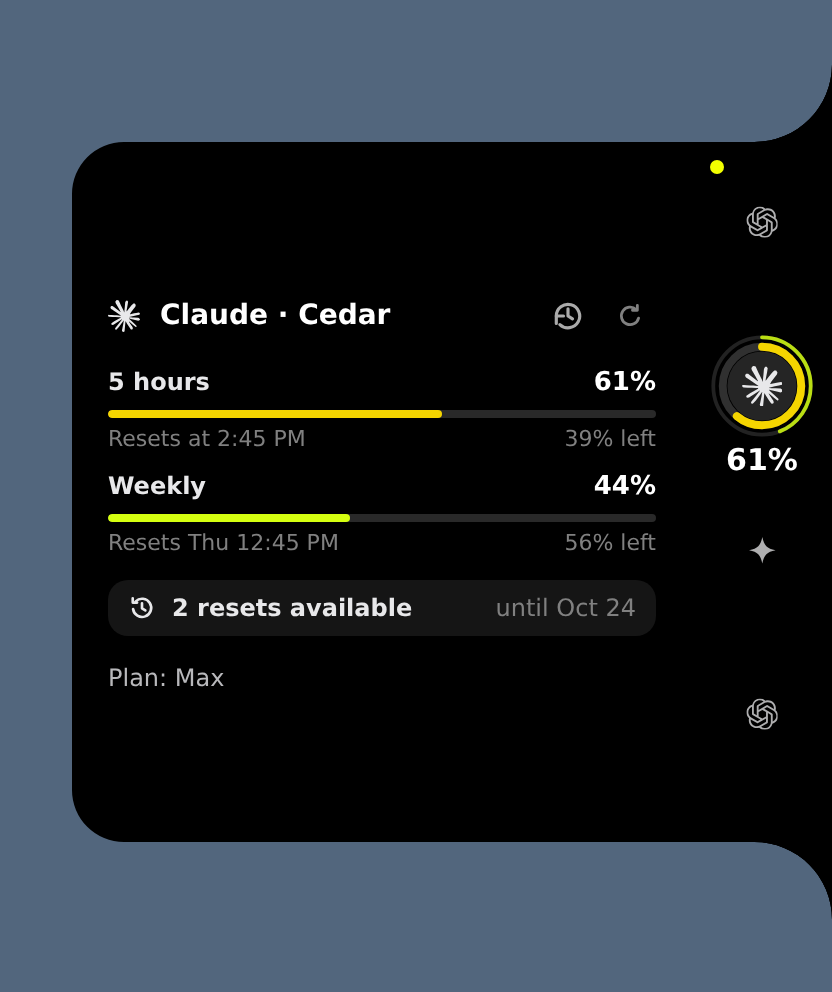
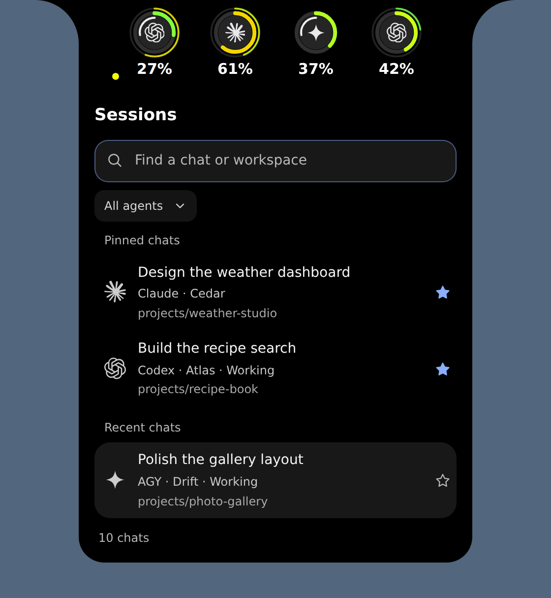
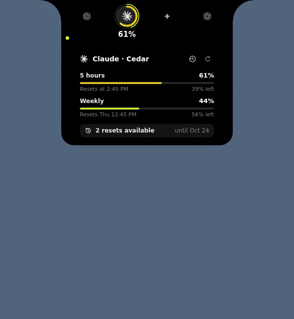
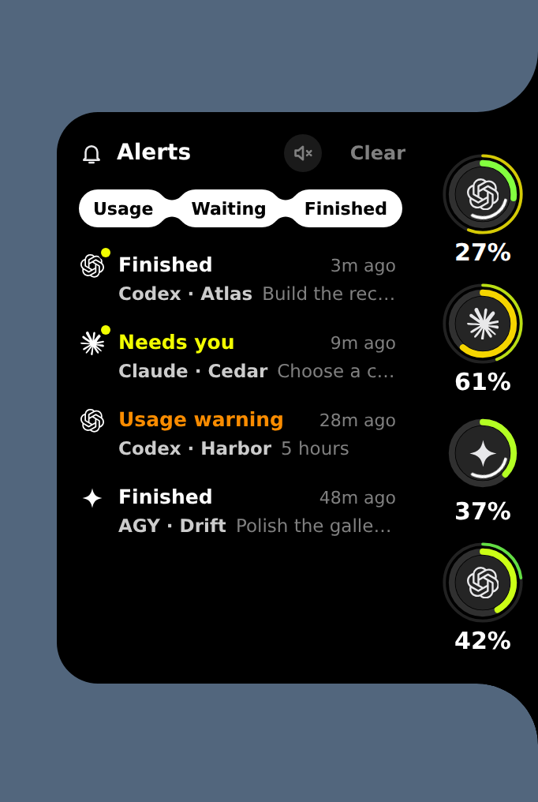
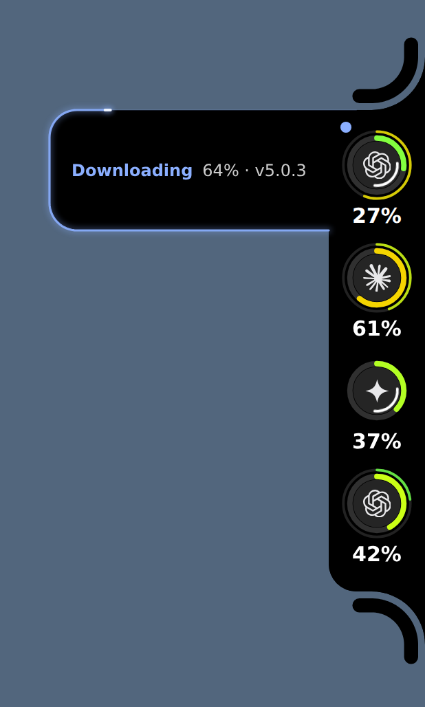
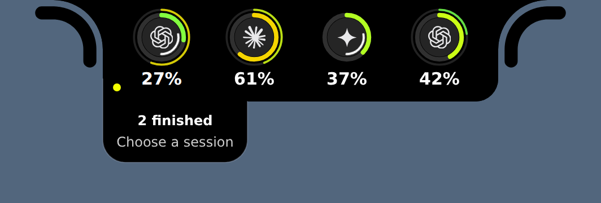
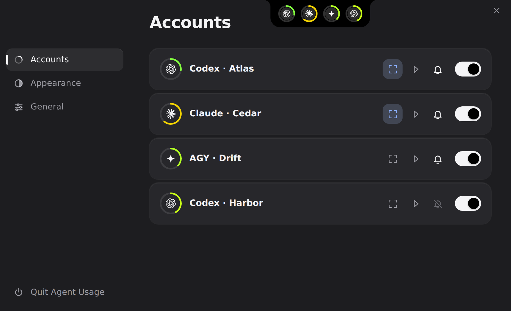

# Agent Usage


A Windows edge notch for **Codex, Claude Code and Antigravity**. See your limits,
know which agents need you, and return to a chat in VS Code without hunting for
its terminal or choosing the account again.

[Download the latest Windows installer](https://github.com/f-petrozzi/Agent-Usage/releases/latest).
The current release is **5.0.10**.

<p></p>

All previews below are captured from the actual 5.0.6 frontend with fictional
accounts, usage and chats: **Codex · Atlas**, **Claude · Cedar**, **AGY · Drift**
and **Codex · Harbor**.

## Features

- **Drop into a chat.** Drop files onto an agent logo, or right-click to paste a
  screenshot. Review previews and choose a chat before sending. Codex supports
  native image queuing when its CLI provides `queue`; Claude and AGY use a
  copy-and-open handoff. See [attachment behavior and limits](docs/attachment-drop.md).
- **Usage at a glance.** Account gauges, five-hour and weekly limits, reset times,
  and credits or banked resets where the provider reports them.
- **Live activity.** Working and Waiting indicators, clickable active sessions,
  AGY approval requests and Codex questions.
- **Find any recent chat.** Search Sessions by title, workspace or session ID,
  filter by agent, pin favorites and keep the list fresh automatically. A quiet
  history icon opens that account's Sessions; Back returns to usage in the same
  attached frame. Search highlights matches; refreshes retain keyboard focus.
  Optional compact rows keep account and workspace on one secondary line.
- **Return to VS Code.** Focus a session's existing terminal or resume a closed
  chat in a named terminal using its saved workspace and CLI account. Supports
  SSH and WSL, and can launch VS Code when it is closed.
- **Focus on your accounts.** Keep one or several selected accounts unfolded at
  rest. Hover reveals the others. Reorder accounts and control their visibility,
  notification muting and test notifications independently. Optional account
  labels and aliases distinguish accounts sharing the same provider.
- **Keep useful notifications.** Usage warnings, input requests, completion
  alerts, optional sound and a saved alert log. Filters hide and restore retained
  alerts; Clear removes them. Several completions gather into one session stack.
- **Fit your desktop.** All four screen edges, multiple monitors, size options,
  pinning, optional tray icon and sign-in startup.
- **Fluid motion.** A perimeter shimmer, quota-reset sweeps, docking rebound and
  merging droplets. Shared frame scheduling and refresh-independent springs
  keep geometry coordinated; Windows pointer following receives native events.
  Notification countdowns pause on hover and follow the
  sliver's real contour. Reduced motion is supported.
- **Updates when they arrive.** Signed release notices announce updates through
  a steady blue dot. Download progress follows the sliver's exposed edges;
  Restart appears after download verification.

## See it in action

### Usage and recent sessions

Inspect an account's quota windows, reset times and credits. Press its header's
history icon to open that account's Sessions in the same attached frame. Search
works immediately while the outline moves; Back restores usage. The global Sessions shortcut searches all accounts.

<table>
  <tr>
    <td></td>
    <td></td>
  </tr>
</table>

<p></p>

### Notifications and download progress

The alert log keeps usage warnings, questions and completions together. Updates
use the same notification corner and take priority while their options are open.
The download light traces the actual sliver rather than a separate pill.

<table>
  <tr>
    <td></td>
    <td></td>
  </tr>
</table>

Finished alerts combine into a compact stack. Hover to see the individual chats,
then click a chat to return to it.

<p></p>

### Account controls

Focus, test a notification, mute notifications or change visibility using the
four compact controls beside each account. Multiple focus selections are supported.

<p></p>

## Install

You need **Windows 10 or 11** and the provider CLIs installed and signed in on a
Linux machine reachable through **WSL or SSH**. To resume chats, install VS Code
with the matching Remote SSH or WSL support.

1. On the machine where your agents run, install the collector:

   ```bash
   git clone https://github.com/f-petrozzi/Agent-Usage.git
   cd Agent-Usage
   scripts/install-agent-usage.sh --force
   ```

2. Download **AgentUsage-Setup-<version>.exe** from the
   [latest release](https://github.com/f-petrozzi/Agent-Usage/releases/latest) and run it
   on Windows. It installs per-user without administrator access and preserves
   existing settings. The installer is unsigned, so SmartScreen may ask you to confirm it.

3. In **Settings → General**, choose your WSL distribution or SSH target. For SSH,
   use the same alias as your VS Code remote window. Provider credentials stay
   on the collector machine.

The bundled VS Code helper is prepared automatically. An existing VS Code window
may need **Developer: Reload Window** once after a helper upgrade. Normal remote
connection and workspace-trust prompts still apply.

## Controls

| Action | Control |
| --- | --- |
| Reveal the notch and follow the cursor | Hold **Scroll Lock**; release to stop |
| Open or close Sessions | **Ctrl + Scroll Lock** |
| Close Sessions and start following again | Hold **Scroll Lock** |
| Peek at account usage | Hover its gauge |
| Hold an account's usage open | Click its gauge |
| Open the notification log | Click the bell, or hover the unread dot to reveal it |
| Hide the notch | **Escape** |
| Pin, refresh, open Sessions or open Settings | Right-click the notch |

The app starts hidden and keeps its tray icon off by default. Opening Agent Usage
again from Start reveals the existing instance. Change the reveal shortcut,
startup behavior and appearance in Settings.

Notifications stay about six seconds, longer when their text needs it. Hover
pauses their countdown. The saved log retains up to **40 alerts from the last week**.
Pins retain up to **six chats per account**, separately for each SSH target or WSL
distribution. Turning a notification filter off hides its retained rows and unread
badge contribution; turning it back on restores them until cleared or expired.

## Update

A steady blue dot announces an update. Hover it, click **Download**, then choose
**Restart** when the verified download is ready. You can also use
**Settings → General → Update → Restart**. Updates do not restart the app automatically.

The app checks once at startup, then listens for signed release notices through
ntfy.sh and catches up after reconnection. The relay carries release notices only;
there is no recurring release-feed polling.

Update the collector separately on the machine running your agents:

```bash
cd Agent-Usage
git pull --ff-only
scripts/install-agent-usage.sh --force
```

## Development and documentation

- [Notch controls, G815 setup and build details](docs/notch.md)
- [Windows performance recording and validation](docs/performance.md)
- [Renderer state and geometry contracts](docs/renderer-contract.md)
- [Release history and validation notes](docs/release-history.md)
- [Shared platform architecture and Mac preparation](docs/platforms.md)
- [Mac readiness audit of 5.0.1](docs/mac-readiness-audit.md)
- [Latest release notes](https://github.com/f-petrozzi/Agent-Usage/releases/latest)

The previews can be regenerated with an installed Playwright module and Chromium:

```bash
PLAYWRIGHT_MODULE=/path/to/playwright node scripts/render-readme.cjs
```

The preview renderer uses isolated fictional fixtures and repository assets. It
does not read account credentials or chat files, connect to a collector, or launch
VS Code. Images are captured at double resolution for crisp text.

The Windows frontend builds on CodeNotch; its licenses and glyph notices are in
[desktop/vendor](desktop/vendor). Agent Usage is available under the [MIT license](LICENSE).

### Account labels and performance recording

Settings → Appearance offers Account labels and aliases and Compact Sessions
rows. With labels enabled, edit an account's alias in Settings → Accounts.
Provider symbols keep their original shapes, with quiet identity light: blue for
Codex A, violet for Codex B, Claude orange and a multicolor AGY glow. Account
identity follows reordering and aliases; quota and activity stay on the rings. Gauges and controls
keep accessible names without native hover tooltips.

Settings → General → Performance recording → Record 10 seconds creates a local,
bounded trace for testing on your Windows display. See the
[performance guide](docs/performance.md) for native refresh-rate and mixed-DPI checks.
