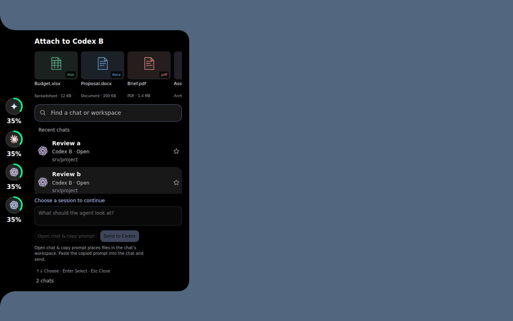

# Drop files into an agent

Drop up to five files (8 MB each) onto a Codex, Claude or AGY logo. The
notch’s material stretches and curves into a dark gravity well in that agent's identity color.
The ink and neighboring symbols flow inward while the physical drop targets stay
fixed. Leaving or cancelling restores the notch. Reduced motion uses a static well.

The notch unfolds its existing session lobe with previews, an optional message,
and only that agent's sessions. Select a session before sending; the app never
guesses which VS Code chat is active. No files leave the computer until you choose
**Send to Codex** or **Open chat & copy prompt**.

While the notch is visible, hover a logo and press **Ctrl+V**, or right-click it
and choose **Paste screenshot into…**. Screenshot pixels and copied local files are
supported. Windows bitmap clipboard formats have a native fallback. The shortcut
is released when the pointer leaves the logo or the session picker takes focus.
The expanded review also accepts pasted images and dropped files, replacing the draft.

**Send to Codex** transfers the files into a private, uniquely named directory in
the selected session's workspace, then invokes native `codex queue --thread UUID
--message TEXT --image PATH` with that account's `CODEX_HOME`. This does not type
into a shell, create a second terminal or change model permission settings. The
host must have a Codex version supporting `queue`; its help is checked before
transfer. PNG, JPEG and WebP files are sent as native image attachments. Other
files are referenced by their workspace paths. Successful delivery means Codex
confirmed queuing, not that the agent finished reading or responding.

**Open chat & copy prompt** works with all three agents: it transfers files, copies
the message and remote paths to the clipboard, and opens the chosen session.
Paste into the agent's composer and send. This is a manual handoff, not a native
image-composer insertion. Close the review with Escape or the existing outside-click behavior; it has no extra X button. A failed session opening leaves copied context
available and reports the opening failure separately.

The session picker does not claim to detect the currently active extension chat.
VS Code's public API provides an `activeTerminal` and its process ID, so a future
helper can match it against collector-verified ancestry. An extension-owned chat
panel does not expose its thread through that API. Selecting a known session is
the dependable route across multiple accounts and windows today.

## Implementation and validation

- Immutable, bounded local reads; no folder expansion or filename-derived shell commands.
- Main resolves account/session identity against fresh collector metadata and
  checks the SSH/WSL scope again after the asynchronous history lookup.
- A fixed Python transport program receives JSON through stdin. Files receive
  mode `0600` in a `0700` temporary directory inside the selected workspace.
- Native queue receives exact UUID, account home, workspace and argv. There are
  no permission-bypass flags or terminal keystrokes. Concurrent submission is
  blocked, and an attempted queue cannot be retried from the same draft because
  a failed connection could have lost its delivery receipt.
- Each transfer directory carries its own ignore rule, so attachments do not
  appear as untracked project changes.
- Drafts expire after 15 minutes and are released when the session lobe closes. Transferred
  files remain in the workspace so a queued turn can read them; remove the
  `.agent-usage-drop-*` directories after the agent is done.
- The notch animation uses the existing shared analytic spring scheduler. It
  stops at rest; only its drag-active streams use compositor animation.
- Backend tests execute the remote program against a temporary mock Codex CLI.
  They check exact account, session and image argv, immutable file staging,
  permissions, hostile filenames, unavailable commands and manual handoff.
- Browser tests check all four edges, target switching, cancellation, reduced
  motion, explicit selection for every attachment and reviewed submission.
- A native Electron test checks actual disk-backed File paths across the
  sandboxed preload, screenshot clipboard data, previews and main-process
  delivery routing. Windows CI also exercises native bitmap/file clipboard data,
  physical hover paste, a real OLE file drag and interaction after dropping.

Research used [Electron's file-drop guidance](https://www.electronjs.org/docs/latest/api/web-utils),
its [current asynchronous clipboard API](https://www.electronjs.org/docs/latest/api/clipboard),
the [VS Code extension API](https://code.visualstudio.com/api/references/vscode-api#window.activeTerminal),
and [official OpenAI CLI image documentation](https://learn.chatgpt.com/docs/codex/cli).
`codex queue` was verified through the installed CLI's help; runtime capability
detection is retained because that command is not established by the cited CLI
overview. The design follows Claude Code's local frontend design skill: retain
the existing black material and Segoe UI type, use the blue/violet/orange agent
colors, spend the visual emphasis on the user-triggered gravity well, and keep
the review form quiet, legible and explicit.

## Absorption and preview refinement (5.0.11)

The contour is sampled and deformed nonuniformly. In 5.0.12 the rounded inner
lip facing the screen center falls first; the boundary against the screen stays
anchored until later in the pull. The slower collapse makes the inward funnel
and trailing strands more visible. As material flows,
radial stretching draws a narrow neck, and angular motion bends the stream into
an accretion-like disk. The original drawing is restored on cancellation. The
screen-edge bleed is clipped before deformation; hit targets never move. The
well appears before the slower material flow, and reduced motion remains static.
This is a deliberate visual metaphor, informed by NASA’s explanations of
[tidal stretching](https://science.nasa.gov/universe/what-happens-when-something-gets-too-close-to-a-black-hole/)
and [accretion disks](https://svs.gsfc.nasa.gov/14619/), rather than a physical simulation.

The design keeps the existing left-aligned session lobe and Segoe UI typography.
Its six core colors are ink `#000000`, text `#e9ebf0`, action blue `#acc7ff`,
spreadsheet green `#62c393`, document blue `#76a9ed`, and PDF red `#ec9189`.
The memorable motion belongs to the drop interaction; previews remain quiet.
Images use actual PNG/JPEG/WebP thumbnails on a transparency checkerboard.

Other formats use distinct page, grid, archive, code, audio or video illustrations
with extension, filename and size. They identify formats without pretending to
render document contents or executing Office files. Long filenames wrap and
multiple files scroll inside the existing frame. No hover tooltips are added.

Direct delivery to the other providers is possible with a session integration,
but is not implemented by this release. Claude’s supported
[channels](https://code.claude.com/docs/en/channels) can inject into an explicitly
configured running session. AGY’s [Remote Control](https://www.antigravity.google/docs/remote-control?tab=cli)
connects to an opted-in running CLI through its authenticated web interface.
Its [headless resume](https://www.antigravity.google/docs/cli/headless/)
starts another process, which is not the same as queuing into the user’s existing
terminal. Installed `claude --help` and `agy --help` were also checked. Neither
exposed an equivalent general-purpose native queue command for this handoff.
The app therefore keeps the explicit open-and-paste route until it can verify
and address a configured delivery bridge for each selected session.
